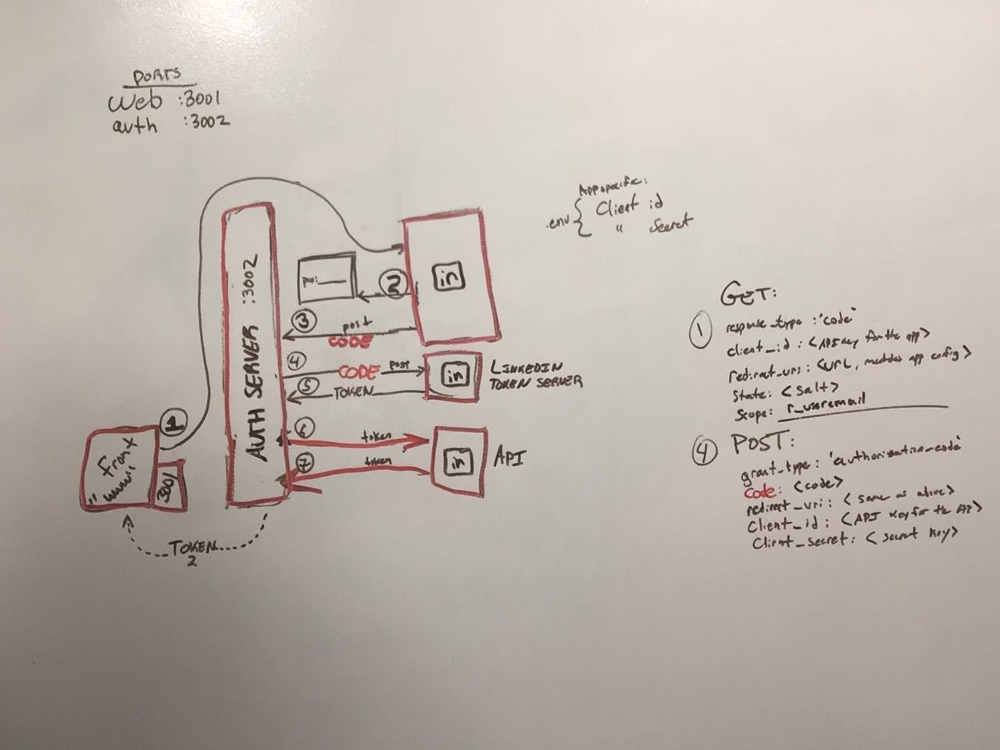

 OAuth Comparative Analysis
================================================================

## Linkedin

### Research Conducted By:  Siobhan, Fletcher, Tanner, Jared

### Overall Score and Comments
#### Score (Out of 10): 9
#### General Comments
Describe the stack (front-end only? full stack?), database, efficiency, etc. Describe the general usability and learnability

Our application is full stack. This means that we have a front end web server, that talks to a back end auth server. 

The application requires a Mongo DB. This is a document database, and not a relational database like Postgres. So for large amounts of users, efficiency may be a factor. Since we're in the early stages of app development, this is not a present concern.

#### Pros
* The linkedin Oauth is very secure
* Documentation was quite good
* Setup time was not unreasonable given the resources provided

#### Cons
* The linkedin Oauth requires HTTPS
* The documentation could have been better

### Ratings and Reviews
#### Documentation
The documentation could have been better. But was overall pretty good.
* more verbose examples
* could have let us know that HTTPS is required, before allowing us to get a token with HTTP
* the explicit format of the requests and responses could have been clearer
* overall, was not too difficult to figure out but took more time

#### Systems Requirements
The application requires a Mongo DB.
It requires a whole suite of Node.js modules. 
It is possible to deploy this on Heroku with the build in support for MongoDB.

#### Ramp-Up Projections
This would take probably 1 day for each dev to become productive.

#### Community Support and Adoption levels
How popular is this framework? What big companies are running on it? How is it "seen" in the general JS community?  Is there an active community of developers supporting and growing it?
Linkedin is failry prevalent in the tech and job industry. In particular it is used for job boards, and networking. 

<!-- ### Links and Resources
* [framework](http://xyz.com)
* [docs](http://xyz.com)
* [examples/tutorials](http://xyz.com) -->

### Code Demos
* [live/running application](https://fstj-web-17-lab.herokuapp.com/)
* [code repository  (auth)](https://github.com/niesssiobhan/17-oauth)
* [code repository  (web)](https://github.com/niesssiobhan/17-web)

### Wireframe Diagram

### Operating Instructions

* Download both repos noted above:
  * `nodemon` from the `auth` server
  * `nodemon` from the `web` server
  * navigate on the browser to their `http://localhost:3001`
  * press the button
  * follow the login procedure

* When running remotely, a `.env` is not required. 
* It is for running locally.